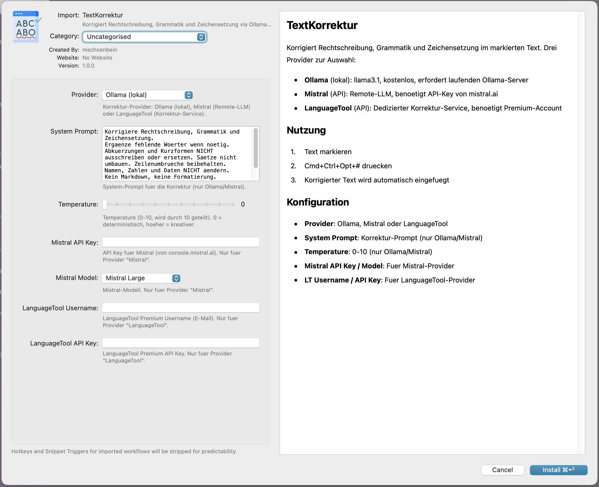

# TextKorrektur

Alfred Workflow zur Korrektur von Rechtschreibung, Grammatik und Zeichensetzung im markierten Text.

Drei Provider zur Auswahl:

| Provider | Typ | Voraussetzung |
|-|-|-|
| **Ollama** | LLM (lokal) | [Ollama](https://ollama.com) mit `llama3.1` |
| **Mistral** | LLM (Remote) | API-Key von [mistral.ai](https://console.mistral.ai) |
| **LanguageTool** | Korrektur-Service | Premium-Account bei [languagetool.org](https://languagetool.org) |

## Installation

1. [TextKorrektur.alfredworkflow](https://github.com/mschoenbein/alfred-text-korrektur/releases/latest) herunterladen
2. Doppelklick → Alfred importiert den Workflow
3. In den Workflow-Einstellungen Provider und API-Keys konfigurieren

## Nutzung

1. Text markieren
2. **Cmd+Ctrl+Opt+#** drücken
3. Korrigierter Text wird automatisch eingefügt

## Konfiguration

- **Provider** — Ollama, Mistral oder LanguageTool
- **System Prompt** — Korrektur-Prompt (nur Ollama/Mistral)
- **Temperature** — 0 = deterministisch, höher = kreativer (nur Ollama/Mistral)
- **Mistral API Key / Model** — für Mistral-Provider
- **LT Username / API Key** — für LanguageTool-Provider

## Credits

Inspiriert von [Writing Assistant](https://github.com/chrisgrieser/alfred-writing-assistant) von [Chris Grieser](https://github.com/chrisgrieser). Icon ebenfalls aus seinem Workflow übernommen.